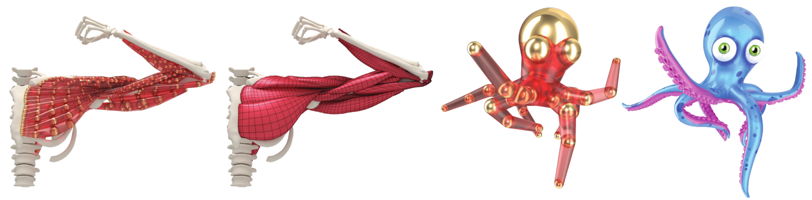

# VIPER -- Volume Invariant Position-based Elastic Rods



## Abstract

We extend the formulation of position-based rods to include elastic volumetric deformations. We achieve this by introducing an additional degree of freedom per vertex -- isotropic scale (and its velocity). Including scale enriches the space of possible deformations, allowing the simulation of volumetric effects, such as a reduction in cross-sectional area when a rod is stretched. We rigorously derive the continuous formulation of its elastic energy potentials, and hence its associated position-based dynamics (PBD) updates to realize this model, enabling the simulation of up to 26000 DOFs at 140 Hz in our GPU implementation. We further show how rods can provide a compact alternative to tetrahedral meshes for the representation of complex muscle deformations, as well as providing a convenient representation for collision detection. This is achieved by modeling a muscle as a bundle of rods, for which we also introduce a technique to automatically convert a muscle surface mesh into a rods-bundle. Finally, we show how rods and/or bundles can be skinned to a surface mesh to drive its deformation, resulting in an alternative to cages for real-time volumetric deformation. 

## License

Except as noted below this project is released under the Apache License, Version 2. See the `LICENSE` file for the full text.

**IMPORTANT NOTICE: The assets `data/mesh.bin` and `data/texture.bin` are proprietary and are *NOT* released under an open-source license. You are *NOT* permitted to redistribute them or to use them for any purpose other than running this demo.**

## How to Build

### Recommended configuration

- NVIDIA GTX1080Ti or better 
- Ubuntu 18.04
- CUDA 10.x

### Initialize submodules
Either user `git clone --recursive'' or, after cloning, execute
```
git submodule init
git submodule update
```

### Install dependencies
```
sudo apt-get install cmake
sudo apt-get install xorg-dev
sudo apt-get install libboost-all-dev
sudo apt-get install libglew-dev
sudo apt-get install libcgal-dev
sudo apt-get install libtbb-dev
```

### Build & run
Ensure /usr/local/cuda exists!
```
export LD_LIBRARY_PATH=/usr/local/cuda/lib64
mkdir build
cd build
cmake ..
make
./demo
```

### Build & run with Docker
If you do not want to set up an Ubuntu 18.04 environment to build, you may use the provided dockerfile to build and run in a container from a Linux host running X11.

Start by installing `nvidia-docker` following the instructions [here](https://docs.nvidia.com/datacenter/cloud-native/container-toolkit/install-guide.html).

You may then build and run the demo with
```
sudo ./build_run_docker.sh
```

## How to cite this work
```
@conference{angles2019viper,
  title={VIPER: Volume Invariant Position-based Elastic Rods},
  author={Baptiste Angles, Daniel Rebain, Miles Macklin, Brian Wyvill, Loic Barthe, John Lewis, Javier von der Pahlen, Shahram Izadi, Julien Valentin, Sofien Bouaziz, Andrea Tagliasacchi},
  booktitle={Proceedings of Symposium on Computer Animation},
  year={2019}
}
```
